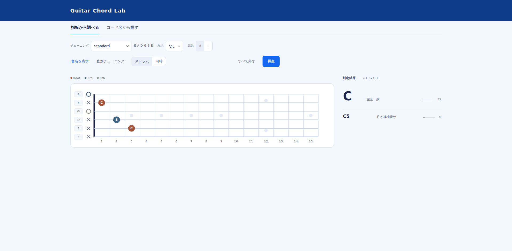

# Guitar Chord Lab

ギターの指板を押さえるとコード名の候補が出て、コード名を入れると押さえ方が並ぶ。
その2つを1画面で行き来できる、中〜上級者向けのコードツールです。

**→ [使ってみる](https://kissou3030.github.io/guitar-chord-lab/)**

<!-- スクリーンショットをここに置くと、リポジトリの顔になります。
     撮り方は README 末尾の「スクリーンショットの追加」を参照。

-->

## できること

指板とコード名は別々の機能ではなく、ひとつのループとして繋がっています。

```
指板を適当に押さえる
  → 「Cm7」と候補が出る
  → 候補をタップ
  → Cm7 の他の押さえ方が並ぶ
  → カードをタップ
  → 指板がその押さえ方に変わる
  → 1音だけ動かす
  → 「Cm9」に変わる
```

- **コード判定** — 押さえた音から候補をスコア順に提示。1位だけでなく、なぜその順位なのかの理由付きで並べます
- **押さえ方の生成** — 34種のコードタイプに対応。データベースは持たず、その場で総当たり生成します
- **チューニング** — Standard / Drop D / DADGAD / Open G / Open D / 半音下げ / 全音下げ。各弦を半音単位で個別に調整も可能
- **カポ** — 実音とシェイプ名を併記（例：`Eb` / `カポ3F: C`）
- **音を鳴らす** — Karplus-Strong 法で撥弦音を合成。音源ファイルは使っていません
- **URLで共有** — 押さえた状態がURLに入るので、リンクを送れば相手の画面に同じ押さえ方が出ます
- **スマホ対応** — 縦持ちでは紙のコードダイアグラムと同じ縦向きのネックに切り替わります

## 設計で大事にしたこと

### 答えを1つに絞らない

コードの同定は本質的に一意に決まりません。

- `C-Eb-G-Bb` は `Cm7` でもあり `Eb6` でもある
- `D-G-A` は `Dsus4` でもあり `Gsus2` でもある

ギターでは5度やルートの省略も日常茶飯事なので、完全一致で照合すると実用的な押さえがほとんどヒットしません。
そこで **12ルート × 34タイプ = 408通り** を総当たりでスコアリングし、候補をスコア順に並べています。

省略の扱いが品質を左右します。省略が許されるのはコードタイプごとに定義した度数（主に5度、11th/13th系の9th）だけで、
7th・6th・テンション・sus が鳴っていない候補は棄却します。これをやらないと候補がノイズだらけになります。

### 色は度数を表す

複数の押さえ方を色分けで重ねる方式は3つ以上で破綻します。色は常に **度数** を意味します。
どの画面でも「ルートは同じ色」で一貫しているので、押さえ方が変わっても構造がそのまま読めます。

### モードを作らない

「判定モード」「検索モード」のようなタブ分割はしていません。指板は常に画面上にひとつだけ存在し、
それが「今の状態」を表す唯一の場所です。

## 実装

**依存関係ゼロ、`index.html` 1ファイル（約57KB）。**
ビルドツールもパッケージマネージャもバックエンドもCDNも使っていません。外部リクエストは0件です。

そのままダウンロードしてダブルクリックすれば動きます。

| | |
|---|---|
| コードタイプ | 34種（テンションコードまで） |
| 判定 | 408通りを総当たりスコアリング、上位10件を表示 |
| 押さえ方の生成 | 16ポジション × 6弦の組み合わせを走査（約75万通り）、Cm7で273件が該当 |
| コード名の表記ゆれ | 102通りの綴りを解釈（`CM7` / `Cmaj7` / `CΔ7`、`Cm` / `Cmin` / `C-` など） |
| 描画 | SVG（指板・カードとも） |
| 音 | Web Audio + Karplus-Strong |

### 演奏可能性の判定

生成した押さえ方は、物理的に押さえられるものだけに絞っています。

- フレット幅が4フレットを超えるものは除外（開放弦は幅に含めない）
- 最小フレットが2本以上の弦で使われていればセーハとみなし、指の本数が4本を超えるものは除外
- セーハ範囲の内側に開放弦がある形は物理的に不可能なので除外
- 難易度をスコア化し、並び順とバッジに反映

## ローカルで動かす

サーバーは不要です。

```
git clone https://github.com/kissou3030/guitar-chord-lab.git
```

`index.html` をブラウザで開くだけです。ダウンロードしたファイルをダブルクリックでも構いません。

## スクリーンショットの追加

リポジトリの見栄えが大きく変わるので、追加をおすすめします。

1. アプリを開いて、適当なコードを押さえた状態にする
2. Windowsなら `Win + Shift + S`、Macなら `Cmd + Shift + 4` で範囲を選んで撮影
3. `screenshot.png` という名前で保存し、このリポジトリにアップロード
4. README冒頭のコメントアウト（`<!--` と `-->`）を外す

## ライセンス

MIT License. 詳細は [LICENSE](LICENSE) を参照してください。
